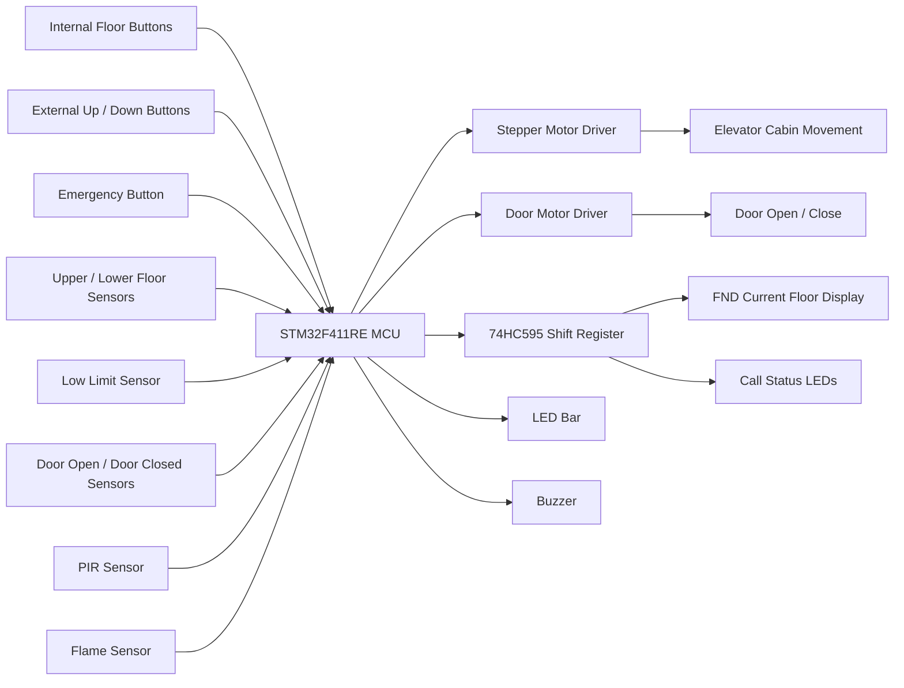
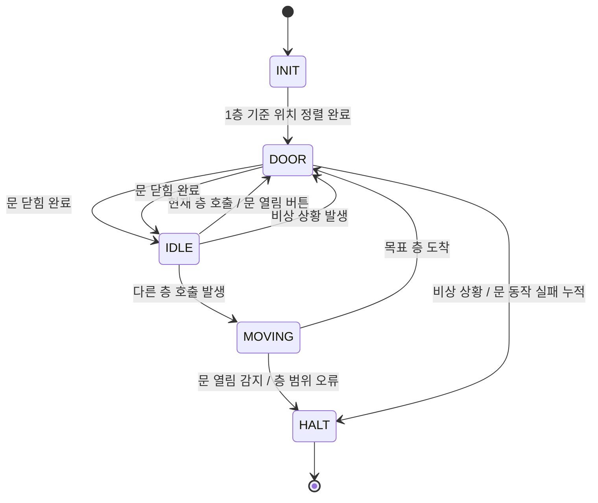

# 🛗 Project 2 Elevator 🛗 

<br>

## 📌 1. Project Summary (프로젝트 요약)

STM32(MCU)을 활용하여 실제 엘리베이터와 유사한 로직의 개발

<br>

## ✨ 2. Key Features (주요 기능)

- 내부 버튼을 통해 목적 층 예약 및 재입력 시 예약 취소 Toggle 기능
- 현재 진행 방향과 같은 방향의 호출을 우선 처리하는 엘리베이터 스케줄링
- 문 열림 유지 시간 표시 및 PIR 센서 감지 시 문 열림 시간 연장
- 화재 감지 센서 또는 비상 버튼 입력 시 비상 모드 진입
- 현재 층 FND 표시, 호출 상태 LED 표시, 이동 방향 LED Bar 표시

---

## ⚙️ 3. Tech Stack (기술 스택)

### 3.1 Language (사용 언어)


### 3.2 Development Environment (개발 환경)


### 3.3 MCU / Board


---

## 🧩 4. Project Structure (프로젝트 구조)

### 4.1 Project Tree (프로젝트 트리)

```text
ELEVATOR/
├── Core/
│   ├── Inc/                         # 각 소스 모듈에 대응하는 헤더 파일
│   │   ├── main.h                   # MCU 핀 정의 및 공통 헤더
│   │   ├── button.h                 # 버튼 구조체 및 입력 처리 함수 선언
│   │   ├── stepper.h                # 스테퍼 모터 제어 함수 선언
│   │   ├── dc_motor.h               # DC 모터 제어 구조체 및 함수 선언
│   │   ├── FND_595.h                # 74HC595 기반 FND/LED 출력 함수 선언
│   │   ├── gpio.h                   # GPIO 초기화 함수 선언
│   │   ├── tim.h                    # 타이머 초기화 함수 선언
│   │   ├── usart.h                  # UART 초기화 함수 선언
│   │   └── dma.h                    # DMA 초기화 함수 선언
│   │
│   └── Src/                         # 프로젝트 핵심 로직 구현부
│       ├── main.c                   # 엘리베이터 FSM, 호출 처리, 안전 제어, 메인 루프
│       ├── button.c                 # 버튼 디바운싱 및 1회 입력 처리
│       ├── stepper.c                # 마이크로스텝 기반 스테퍼 모터 제어
│       ├── dc_motor.c               # DC 모터 정/역회전 및 정지 제어
│       ├── FND_595.c                # FND, LED, LED Bar 출력을 위한 74HC595 제어
│       ├── gpio.c                   # 버튼, 센서, LED, 부저 등 GPIO 설정
│       ├── tim.c                    # PWM, 스텝 주기, 도어 타이머, us delay 타이머 설정
│       ├── usart.c                  # UART2 설정
│       ├── dma.c                    # DMA 설정
│       └── stm32f4xx_it.c           # EXTI 및 TIM 인터럽트 핸들러
│
├── Drivers/                         # STM32 HAL Driver 및 CMSIS
├── ELEVATOR.ioc                     # STM32CubeMX 하드웨어 설정 파일
├── STM32F411RETX_FLASH.ld           # Flash 링커 스크립트
├── STM32F411RETX_RAM.ld             # RAM 링커 스크립트
└── README.md                        # 프로젝트 설명 문서
```

---

### 4.2 Hardware BlockDiagram (하드웨어 블록다이어그램)



---

### 4.3 State Machine (상태 머신)



---

## 🎬 5. Demonstration (시연)

<a href="https://m.youtube.com/watch?v=pdpKZhSDCo0&pp=0gcJCUECo7VqN5tD">
  
</a>

---

## 🎯 6. Troubleshooting (문제 해결 기록)

### 6.1 층 호출 우선순위 문제 (Floor Request Scheduling)

**🔍 Issue (문제 상황)**

- 엘리베이터 이동 중 새로운 호출이 들어오면 어떤 층에 먼저 정지해야 하는지 판단이 필요함
- 단순히 마지막 입력 층만 목적지로 사용하면 기존 예약이 덮어써질 수 있음

**❓ Analysis (원인 분석)**

- 엘리베이터는 내부 목적 층, 외부 상행 호출, 외부 하행 호출을 별도로 관리해야 함
- 현재 진행 방향과 반대 방향의 호출까지 즉시 처리하면 실제 엘리베이터와 다른 비효율적인 동작이 발생함

**❗ Action (해결 방법)**

- `carCall[]`, `hallCallUp[]`, `hallCallDown[]` 배열로 내부/외부 호출을 분리 저장
- 이동 중에는 현재 진행 방향과 같은 방향의 호출을 우선 처리
- 진행 방향의 마지막 요청 지점인 `runLimit`에서는 회차를 위해 방향이 다른 호출도 함께 처리
- 정지 후 `clearRequest()`를 통해 해당 층의 호출 상태를 해제

**✅ Result (결과)**

- 내부 버튼, 외부 상행 버튼, 외부 하행 버튼을 독립적으로 처리할 수 있음
- 진행 방향 우선 처리와 회차 정지 로직을 통해 실제 엘리베이터와 유사한 스케줄링을 구현함

---

### 6.2 스테퍼 모터 급가속 문제 (Motor Acceleration Control)

**🔍 Issue (문제 상황)**

- 스테퍼 모터를 고정 속도로 즉시 구동하면 출발과 정지 시 움직임이 부자연스럽고 탈조 가능성이 높아짐

**❓ Analysis (원인 분석)**

- 모터 속도가 순간적으로 크게 바뀌면 관성 때문에 안정적인 위치 제어가 어려워짐
- 엘리베이터 이동은 출발, 이동, 감속, 정지 흐름이 필요함

**❗ Action (해결 방법)**

- `motorDrive()`에서 `ACCEL`, `DECEL`, `STOP` 상태를 분리
- `MIN_FREQUENCY`, `MAX_FREQUENCY`, `A_MAX_HZ_PER_S`, `J_MAX_HZ_PER_S2` 값을 이용하여 속도와 가속도를 제한
- `TIM10` 인터럽트를 이용하여 스텝 진행 주기를 조절
- `TIM3 PWM`과 64단계 마이크로스텝 테이블을 이용하여 스테퍼 모터를 부드럽게 제어

**✅ Result (결과)**

- 엘리베이터의 출발과 정지 동작이 단계적으로 처리됨
- 급격한 속도 변화가 줄어들고 안정적인 층간 이동이 가능해짐

---

### 6.6 출력 핀 부족 및 상태 표시 문제 (Display Output Expansion)

**🔍 Issue (문제 상황)**

- 현재 층, 외부 호출, 내부 호출, 문 버튼, 비상 상태 등 표시해야 할 정보가 많음
- 모든 LED와 FND를 MCU GPIO에 직접 연결하면 핀이 부족해질 수 있음

**❓ Analysis (원인 분석)**

- 4층 엘리베이터는 내부 버튼 LED, 외부 호출 LED, 방향 표시, 현재 층 표시 등 출력 장치가 많음
- MCU의 GPIO를 효율적으로 사용하기 위한 출력 확장 방식이 필요함

**❗ Action (해결 방법)**

- 74HC595 시프트 레지스터를 사용하여 출력 핀을 확장
- `dataOut()`에서 32bit 데이터를 시리얼로 전송하여 FND와 LED 상태를 동시에 갱신
- `showFND()`로 현재 층을 표시하고, `showBar()`로 문 열림 대기 시간을 표시
- 별도 LED Bar를 사용하여 엘리베이터 이동 방향을 시각적으로 표현

**✅ Result (결과)**

- 적은 수의 MCU 핀으로 여러 출력 장치를 제어할 수 있음
- 현재 층, 호출 상태, 문 상태, 이동 방향을 사용자가 직관적으로 확인할 수 있음

---

## 7. Code Flow (전체 코드 흐름)

```text
1. HAL_Init() 및 시스템 클럭 설정
2. GPIO, DMA, UART, TIM3, TIM9, TIM10, TIM11 초기화
3. 버튼 구조체 초기화
4. 스테퍼 모터 PWM 초기화
5. 센서 초기 상태 읽기
6. while(1) 반복
   ├── 내부/외부 버튼 입력 확인
   ├── PIR 센서, 화재 센서, 비상 버튼 확인
   ├── elevatorFSMUpdate()로 상태 머신 실행
   ├── 현재 층 FND 표시
   ├── 호출 상태 LED 출력
   ├── 도착 부저 출력
   └── 이동 방향 LED Bar 갱신
```

---

## 8. Main Modules (주요 모듈 설명)

| 파일 | 역할 |
|---|---|
| `main.c` | 엘리베이터 전체 상태 머신, 층 호출 스케줄링, 도어 제어, 비상 처리, 표시 장치 제어 |
| `button.c` | 버튼 디바운싱과 1회 입력 감지 처리 |
| `stepper.c` | 64단계 마이크로스텝 기반 스테퍼 모터 회전 제어 |
| `dc_motor.c` | DC 모터 정방향/역방향/정지 제어 |
| `FND_595.c` | 74HC595 시프트 레지스터를 이용한 FND 및 LED 출력 제어 |
| `gpio.c` | 버튼, 센서, LED, 부저, 모터 방향 핀 초기화 |
| `tim.c` | PWM, 스텝 인터럽트, 도어 카운터, us 지연용 타이머 설정 |
| `stm32f4xx_it.c` | 외부 인터럽트와 타이머 인터럽트 처리 |

---


단순한 모터 구동에 그치지 않고, 엘리베이터 상태를 `INIT`, `IDLE`, `MOVING`, `DOOR`, `HALT`로 나누어 FSM 방식으로 관리했습니다. 또한 버튼 디바운싱, 센서 기반 정지, 문 끼임 대응, 화재/비상 처리, 74HC595 출력 확장 등을 적용하여 안정성과 확장성을 고려했습니다.
